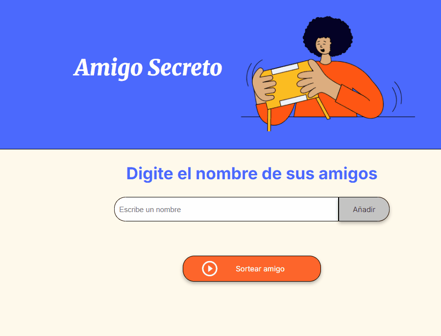

# Practicando Lógica de Programación: Challenge Amigo secreto.
   

## Autor.
**Reynosa Vidal Fernando Jose**

---

## Descripción.
Este proyecto es una practica de "Principiante en Programación G9 - ONE". El cual nos permite agregar nombres a una lista y realizar el sorteo de un nombre de manera aleatoria.

---

## Estado del proyecto.
**Finalizado**

---

## Funcionalidades Implementadas en el proyecto.
- **Agregar nombre** y mostrarlo en pantalla.
- **Actualizar lista de amigos** en base a los nombres que se incertan.
- **Sortear un amigo secreto** entre la lista de amigos ingresada.
- **Limpiar lista de amigos en pantalla** cuando se presiona el boton de sortear amigo.
- **Limpiamos la lista de amigos** para que se puedan introducir nuevos nombres.

---

## Vista Previa.
*(GIF del proyecto)*

---

## Como usar 
1. Clona el repositorio con git clone https://github.com/Fernando5899/reto-amigo-secreto.git
2. Abre al archivo `Index.html` en tu navegador de preferencia.
3. Ingresa los nombre de los amigos 
4. Presiona el boton de "Sortear amigo"